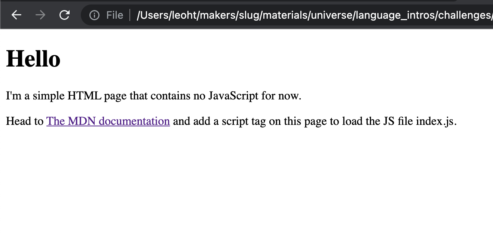
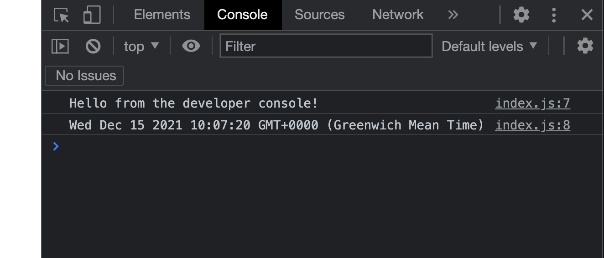
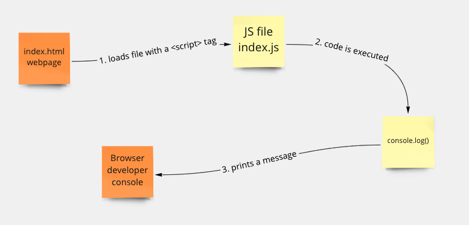

# JavaScript and the browser

## Objectives

 * Load a JavaScript file in the browser.
 * Use the browser JS console.

<!-- OMITTED -->

In this first section, you'll **discover with an example** how JavaScript can be
executed within a web browser — rather than Node.js — and how we can get
visibility into our code. 

## Downloading the exercise scaffold

You will first need to download [the provided files for this first
example](../resources/example-1.zip) to work through the exercises. Unzip this
in a new directory and open it in your code editor. You should have the
following files:
 * `index.html`
 * `index.js`
 * `package.json` and `package-lock.json`

Having at least these different files will be common in the rest of this module.
We'll often refer to the file `index.js` as the **main file**, and the
`index.html` as the **web page**.

## Setup

The presence of `package.json` tells us that there are dependencies to install.
Run `npm install` inside the directory to install them (they'll be useful in the
next section):

```bash
$ npm install
```

Next, open the HTML file in your browser. You should see a title and two
paragraphs.



## Exercise

To complete the exercise you'll need to:
 * research [how to use a `<script>`
   tag](https://developer.mozilla.org/en-US/docs/Web/HTML/Element/script#basic_usage)
   to load a JavaScript file on the page.
 * use the developer console.

### Questions

1. Modify the HTML code to load the main file `index.js` on the page, using a
   `<script>` tag at the end of the body. You should be able to open the
   browser's developer console from this page and see the message `'Hello from
   the developer console!'` logged.
2. Add code in the main JS file to log to the console [`new
   Date()`](https://developer.mozilla.org/en-US/docs/Web/JavaScript/Reference/Global_Objects/Date/Date).
   If you reload the page, you should be able to see the current date printed in
   the console.



### Troubleshooting common problems

 * The browser is quite strict on the `<script>` tag syntax — make sure you
   follow the example in the resource linked above.

## The Developer Console

As you've seen in the previous exercise, using `console.log` in the browser is
behaving differently than when running JS in node. Any output is printed to the
browser developer console, so remember to have it open at all times — and the
shortcut to quickly open it (`Option`+`Command`+`J` on Mac)! 

**Keep in mind that `console.log` does not write on the page — it is used only
for you to debug using the developer console, not to display information to the
users of the application**

## Diagram

Here's a diagram of what we've covered in this first section. There will be a
lot of new concepts to understand in this module, and diagramming can be a
really powerful tool. You're encouraged to make your own diagrams, and validate
them with your peers or coaches.



## Additional resources

 * [MDN - The `<script>`
   element](https://developer.mozilla.org/en-US/docs/Web/HTML/Element/script#basic_usage)
 * [Log messages with the Chrome developer
   console](https://developer.chrome.com/docs/devtools/console/log/)

[Next Challenge](02_build_tool.md)

<!-- BEGIN GENERATED SECTION DO NOT EDIT -->

---

**How was this resource?**  
[😫](https://airtable.com/shrUJ3t7KLMqVRFKR?prefill_Repository=makersacademy/javascript-web-applications&prefill_File=contents/01_javascript_browser.md&prefill_Sentiment=😫) [😕](https://airtable.com/shrUJ3t7KLMqVRFKR?prefill_Repository=makersacademy/javascript-web-applications&prefill_File=contents/01_javascript_browser.md&prefill_Sentiment=😕) [😐](https://airtable.com/shrUJ3t7KLMqVRFKR?prefill_Repository=makersacademy/javascript-web-applications&prefill_File=contents/01_javascript_browser.md&prefill_Sentiment=😐) [🙂](https://airtable.com/shrUJ3t7KLMqVRFKR?prefill_Repository=makersacademy/javascript-web-applications&prefill_File=contents/01_javascript_browser.md&prefill_Sentiment=🙂) [😀](https://airtable.com/shrUJ3t7KLMqVRFKR?prefill_Repository=makersacademy/javascript-web-applications&prefill_File=contents/01_javascript_browser.md&prefill_Sentiment=😀)  
Click an emoji to tell us.

<!-- END GENERATED SECTION DO NOT EDIT -->
